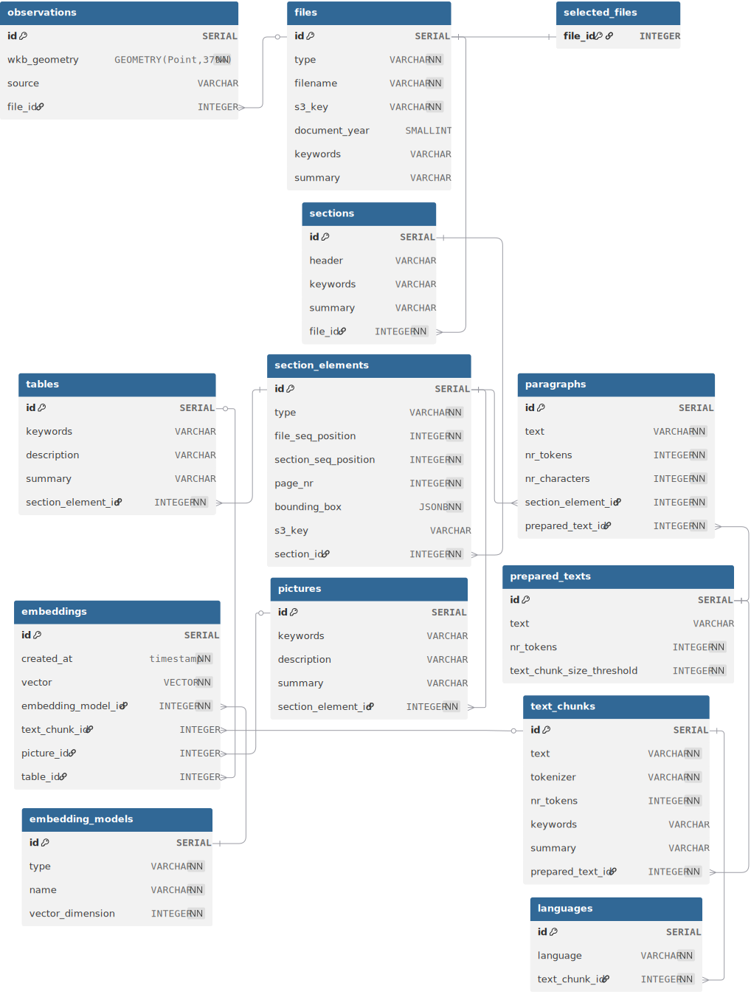

# ZRSVN RAG Preprocessing  
  
System for preprocessing documents for RAG (Retrieval Augmented Generation) applications.  
  
## About the project  
  
The system implements a four-phase pipeline for preprocessing PDF documents:  
  
- **Phase 1**: Parsing PDF documents and generating JSON structures
- **Phase 2**: Data preprocessing and insertion into a PostgreSQL database
- **Phase 3**: Generation of metadata (keywords, summaries, descriptions) using LLMs
- **Phase 4**: Generation of vector embeddings for semantic search
  
## Features  
  
- Downloading PDF documents from S3/MinIO storage
- Extraction of text, images, and tables from PDFs using Docling 
- Segmentation of text into optimal-length chunks
- LLM-generated keywords and summaries
- Detection of the language of text blocks
- Generation of 768-dimensional embeddings (default using the BAAI/bge-m3 model)
- Hierarchical metadata structure (document → section → element)
  
## Technical requirements  
  
- Python 3.8+
- PostgreSQL database with the `rag_najdbe` schema
- MinIO/S3 storage
- Ideally a CUDA-compatible GPU (for faster embedding generation)
- Azure OpenAI API access
  
## Installation  
  
1. Clone the repository:  
```bash  
git clone https://github.com/gregorgatej/zrsvn-rag-preprocessing.git  
cd zrsvn-rag-preprocessing
```

2. Install dependencies:
```bash  
pip install -r requirements.txt
```

3. Create a .env file with the following variables:
```bash  
S3_ACCESS_KEY=your_s3_access_key  
S3_SECRET_ACCESS_KEY=your_s3_secret_key  
POSTGRES_PASSWORD=your_postgres_password  
AZURE_OPENAI_API_KEY=your_azure_openai_key  
AZURE_OPENAI_ENDPOINT=your_azure_endpoint
```

4. Prepare the PostgreSQL database with the rag_najdbe schema.

## Usage

### Running the full pipeline

```bash  
python pipeline/all_phases_flow.py
```

### Running individual phases

```bash  
python pipeline/phase1_flow.py
python pipeline/phase2_flow.py
python pipeline/phase3_flow.py
python pipeline/phase4_flow.py
```

## Data structure

The system creates a hierarchical data structure in the PostgreSQL database:
- files - basic document metadata
- sections - sections within documents
- section_elements - individual elements (paragraphs, images, tables)
- text_chunks - optimized text blocks for RAG
- embeddings - vector representations for semantic search

## DB schema



<sub>Diagram generated with [dbdiagram.io](https://dbdiagram.io/)</sub>

## Orchestration

The pipeline uses Prefect to manage data flows with built-in support for:
- Automatic retries on errors (3 times with a 2s delay)
- Progress tracking with JSON files
- Sequential execution of phases